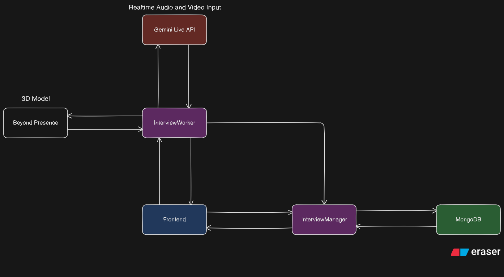

## 

**Lumina** is the ultimate AI-powered ecosystem for career growth and education. It combines autonomous agents, generative AI, and real-time collaboration to help you **Find Work**, **Learn Skills**, and **Plan Your Future** - all in one platform.


[](https://vimeo.com/1160817143?share=copy)

## The 7 Core Features

### 1. Live AI Interview
An AI Agent which takes Live AI Interview analyzing both your audio and video with the help of Google Live API!
Interactive Agent with context as your resume and thne gives report analysis at the end of interview.



### 2. Intelligent Job Discovery
Lumina uses a **6-Agent Pipeline** to scour the web, aggregate listings, normalize and deduplicate jobs, and score them against your resume.
Get deep market analysis (salary trends, skill gaps) from Google Jobs, ATS Feeds and more.
Use chat feature to ask "Which of these jobs allows 4-day workweeks?" and get answers based on the actual job descriptions.


### 3. Generative Courses
Turn any topic into a full interactive course in seconds. With Text, Images, Diagrams and Quizzes.
With capabiliies of flashcard & slides generation, read aloud chapters and expanding the existing course with your PDFs/Videos.
Use chat feature to ask "Summarize this chapter for me" and get answers based on the chapter's content.


### 4. Smart Career Roadmaps
Visualize your journey from beginner to expert using a DAG to map out required skills and their dependencies in form of an interactive roadmap.
Click on a particular skill, to learn more about it, find resources and more!
Use chat feature to ask more about the roadmap and get answers based on the roadmap's content.


### 5. AI Video Generation
Create educational videos from text prompts. Automatically generates voiceovers and renders using Remotion for the user with the option of downloading the video.


### 6. Collaborative Notes
A Notion-like editor built for peer learning with real time sync, multiple plugins to insert images, videos and excalidraw diagrams and options to export as PDF, HTML and more.


### 7. Video Assistant (Chat with YouTube)
Learn from video content without watching the whole thing. Indexes video captions enabling RAG Q&A, Summarization and Notes Generation.
Gives time aware answers where the video is currently playing.
A Socratic Tutor which tests your knowledge using Bloom's Taxonomy.


---

### Technology Stack

| Domain | Technolgies |
|--------|-------------|
| **Backend** | **Expressjs**, **FastAPI**, **LangChain**, **LangGraph** (Orchestration) |
| **Frontend** | **React**, **Vite**, **Framer Motion**, **TailwindCSS** |
| **AI / LLM** | **Gemini Live**, **Groq** (Llama & Qwen), **Imagegen** (Image/Video) |
| **Database** | **MongoDB** (Core), **ChromaDB** (Vector Search), **Redis** (Caching) |
| **Cloud** | **GCP** (Various GCP Services) |
| **Tools** | **SerpAPI** (Jobs), **JobSpy**, **Tavily** (Research), **Y.js** (Collaboration), **Livekit**, **Beyond Presence** |

---

## Research and Translation

| Service | Role |
|-------|------|
| **Reseach** | Uses Tavily to research web and find updated context for agents to work with. |
| **Translation** | Translates data to user's preferred language. |

---

## Agent Breakdown

### Job Agents
| Agent | Role |
|-------|------|
| **Resume** | Parses PDF/Text resumes into structured data |
| **Intent** | Expands roles (e.g., "React" -> "Frontend", "UI") |
| **Query** | Generates targeted search strings for job sites |
| **Discovery** | Aggregates jobs from Google Jobs, ATS & JobSpy |
| **Normalization** | Deduplicates and standardizes job data |
| **Scoring** | Ranks jobs 0-100% against your Resume |
| **Insights** | (Lazy) Generates market analysis on command |

### Course Agents
| Agent | Role |
|-------|------|
| **Planner** | Builds the Dependency Graph (Syllabus) |
| **Writer** | Generates structured JSON content for chapters |
| **Diagram** | **Writes Executable React Code** for visuals |
| **Tester** | Creates Quizzes (MCQ + Open Text) for each chapter |
| **Chat** | AI Tutor that answers questions from context |
| **Slide** | Generates Reveal.js presentation decks |
| **Flashcard** | Creates Anki-compatible study aids |
| **Grader** | Grades subjective answers against rubrics |
| **Expansion** | Updates course graph with new materials (PDF/Video) |

### Interview Agent
| Agent | Role |
|-------|------|
| **Interviewer** | Real-time voice agent that conducts interviews and records evaluations |

### Roadmap Agents
| Agent | Role |
|-------|------|
| **Roadmap** | Generates the roadmap (Nodes & Edges) via Research |
| **Chat** | AI Tutor offering context-aware guidance |

### Video Generation Agents
| Agent | Role |
|-------|------|
| **Script** | Writes educational scripts with **Real-time Research** |
| **Director** | Scene-by-scene visual planning & execution |
| **Voice** | Generates neural audio narration (TTS) |

### Video Assistant Agents (Learn with AI)
| Agent | Role |
|-------|------|
| **Assistant** | Summaries, RAG Q&A, and Notes generation |
| **TeachBack** | **Socratic Tutor** that tests your understanding (Bloom's Taxonomy) |


---

## Quick Start

### Prerequisites
- Node.js (v18+)
- Python 3.13+
- uv (Python package manager) - Install: `pip install uv`
- MongoDB instance (local or Atlas)
- Redis instance (local or cloud)

### One-Time Setup: Code Checker
The FastAPI server has an internal ESLint-based code validator for AI-generated React components. You need to install its dependencies once:

```bash
cd fastapi-server/src/utils/code_checker
npm install
cd ../../../..
```

**NOTE**: This is NOT a separate server. The FastAPI server calls it automatically.

### Running the Project
This project has 3 servers that need to run simultaneously. Open 3 separate terminal windows for each.

#### Terminal 1: Frontend (React + Vite)
```bash
cd client
npm install
npm run dev
```

Create `.env` file using the help of `.env.example`

*   Runs on: http://localhost:5173

#### Terminal 2: Collaboration Server (Express.js)
```bash
cd express-server
npm install
```

Create `.env` file using the help of `.env.example`

```bash
npm run dev
```
*   REST API on: http://localhost:3002
*   WebSocket on: ws://localhost:3001

#### Terminal 3: AI Engine (FastAPI)
```bash
cd fastapi-server
uv sync
```

Create `.env` file using the help of `.env.example`

```bash
uv run uvicorn src.main:app --reload --port 8000
```
*   Runs on: http://localhost:8000
*   API Docs: http://localhost:8000/docs

---
